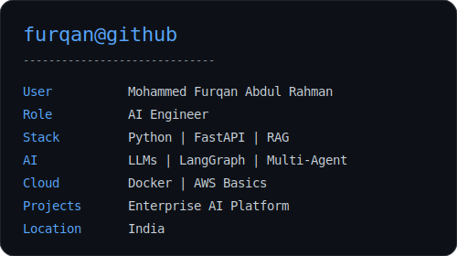

<h3><code>furqan@github ~ $ whoami</code></h3>
<table>
  <tr>
    <td valign="top"></td>
    <td valign="top"></td>
  </tr>
</table>

 

<h3>
<code>
furqan@github ~ $ projects
</code>
</h3>

<table>

<tr>

<td>

🚀 Enterprise RAG Knowledge Platform

</td>

</tr>

<tr>

<td>

🤖 Multi-Agent AI Customer Support System

</td>

</tr>

<tr>

<td>

🧠 Brain Tumor Detection using Deep Learning

</td>

</tr>

</table>

 

<h3>
<code>
furqan@github ~ $ skills
</code>
</h3>

Python • FastAPI • Generative AI • RAG • LLMs • LangGraph
 
Machine Learning • Deep Learning • Docker • AWS

